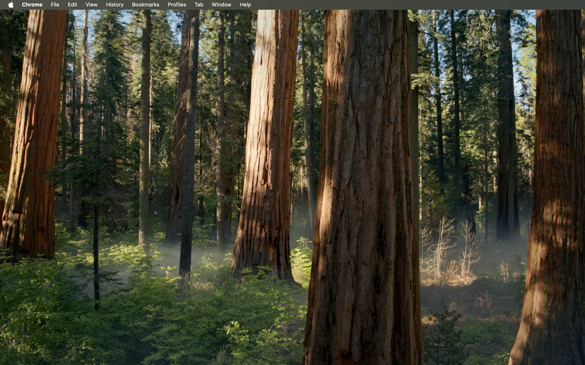

# Personal Finance Tracker

A self-hosted personal finance dashboard that automatically pulls transactions from bank alert emails, categorizes spending, and tracks budgets — built as a replacement for paid services like Monarch Money.



## What It Does

- **Automatic transaction sync** — reads Wells Fargo and American Express alert emails via Gmail IMAP and parses transaction data (merchant, amount, date) using regex
- **Smart auto-categorization** — 50+ keyword rules map merchants to spending categories (Fast Food, Groceries, Bars, Streaming, AI, etc.) with fallback inline editing in the UI
- **Local SQLite database** — all data stored locally, no third-party services
- **Excel export** — transactions also written to a `.xlsx` file with SUMIFS-driven budget sheets
- **Web dashboard** — Flask app running at `localhost:5001` with:
  - Monthly summary cards (income, expenses, net balance, savings rate)
  - Spending by category donut chart
  - Monthly trends bar chart (6-month view)
  - Filterable transactions table with one-click category editing
  - Budget vs. actual progress bars with inline editing
- **Fully automated** — macOS LaunchAgent runs the sync daily at 8:07am and keeps the dashboard running on login

## Tech Stack

- **Backend:** Python 3, Flask, SQLite (`sqlite3`), openpyxl
- **Email parsing:** `imaplib`, `email`, `re` (regex)
- **Frontend:** Vanilla JS, Chart.js, CSS variables (no framework)
- **Scheduling:** macOS `launchd` (LaunchAgent plist)

## Setup

### 1. Clone and install dependencies

```bash
git clone https://github.com/yourusername/finance-tracker.git
cd finance-tracker
pip3 install flask openpyxl
```

### 2. Enable Gmail IMAP and create an App Password

1. Go to [myaccount.google.com/security](https://myaccount.google.com/security)
2. Enable 2-Step Verification if not already on
3. Go to **App Passwords** → generate one for "Mail"
4. Enable IMAP in Gmail Settings → See All Settings → Forwarding and POP/IMAP

### 3. Configure credentials

```bash
cp config.example.json config.json
```

Edit `config.json`:
```json
{
  "gmail_email": "your.email@gmail.com",
  "gmail_app_password": "xxxx xxxx xxxx xxxx",
  "alerts_enabled_since": "01-Jan-2026"
}
```

### 4. Enable bank transaction alerts

- **Wells Fargo:** Sign in → Account Services → Alerts → turn on purchase alerts
- **Amex:** Account → Notifications → enable "Large Purchase" and transaction alerts

### 5. Run the dashboard

```bash
python3 app.py
```

Visit [http://localhost:5001](http://localhost:5001)

### 6. Run a manual sync

```bash
python3 sync_transactions.py
```

### 7. (Optional) Auto-start on macOS login

```bash
cp launchagents/com.finance.dashboard.plist ~/Library/LaunchAgents/
cp launchagents/com.finance.sync.plist ~/Library/LaunchAgents/
launchctl load ~/Library/LaunchAgents/com.finance.dashboard.plist
launchctl load ~/Library/LaunchAgents/com.finance.sync.plist
```

## Project Structure

```
├── app.py                  # Flask web server + REST API
├── db.py                   # SQLite helper (queries, inserts, imports)
├── sync_transactions.py    # Gmail IMAP sync + email parsers
├── templates/
│   └── index.html          # Single-page dashboard (vanilla JS + Chart.js)
├── static/
│   └── favicon.ico
├── config.example.json     # Credentials template (copy to config.json)
└── .gitignore
```

## Features In Detail

### Email Parsing
Supports multiple email formats from both banks:
- Amex standard purchase alerts
- Amex "Large Purchase Approved" alerts
- Wells Fargo online/phone/mail purchase alerts
- Wells Fargo Zelle and deposit alerts

### Category Editing
Any transaction category can be edited inline — click the category tag in the Transactions tab and select from the dropdown. Changes persist immediately to the database.

### Deduplication
Tracks processed email IDs in `.processed_ids.json` to avoid adding the same transaction twice across sync runs.

## Why I Built This

I was paying $15/month for Monarch Money to track my spending. I built this in a weekend to replace it — it does everything I actually used: automatic transaction import, budget tracking, and a clean dashboard to review spending. Total cost: $0.
